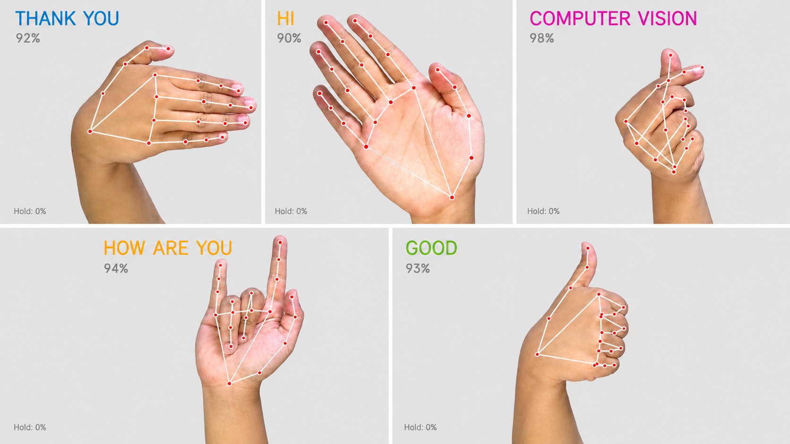
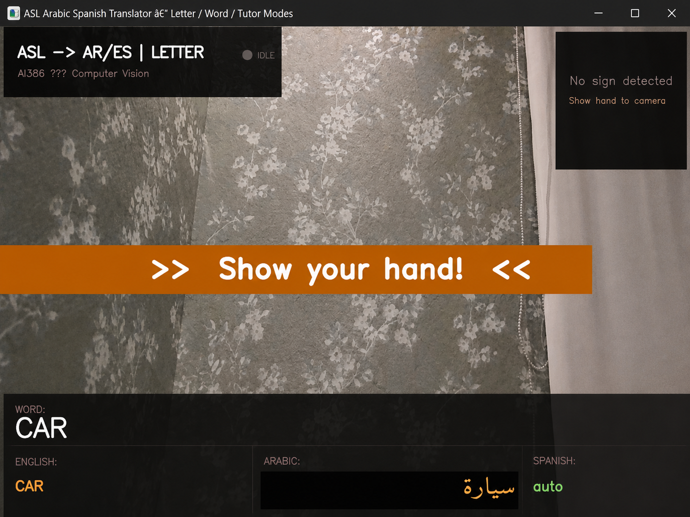
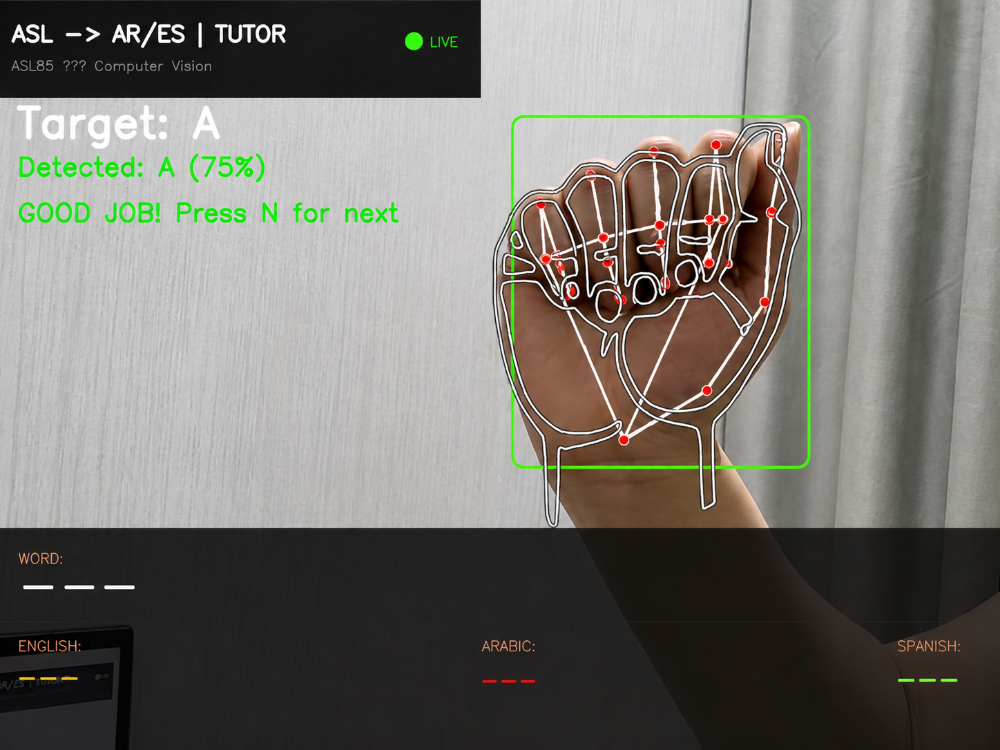
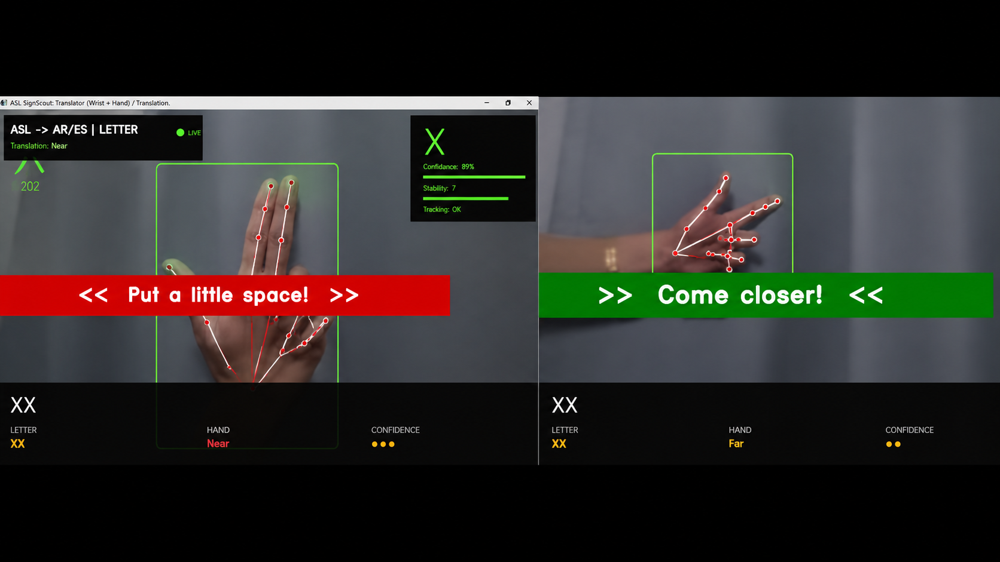
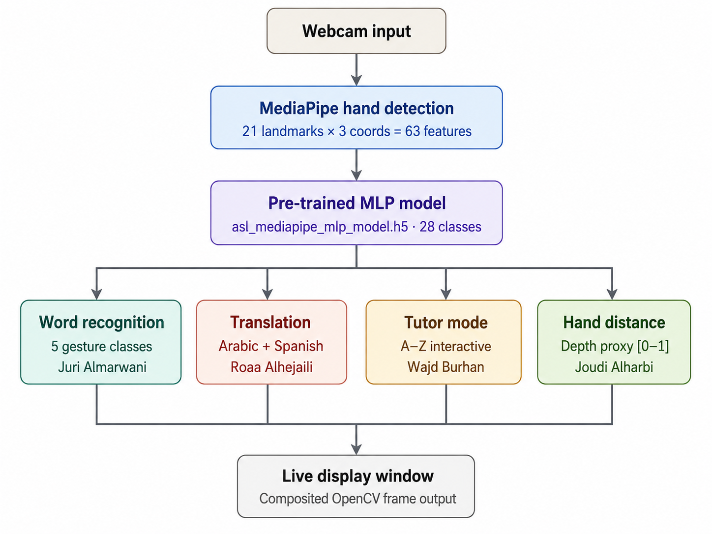
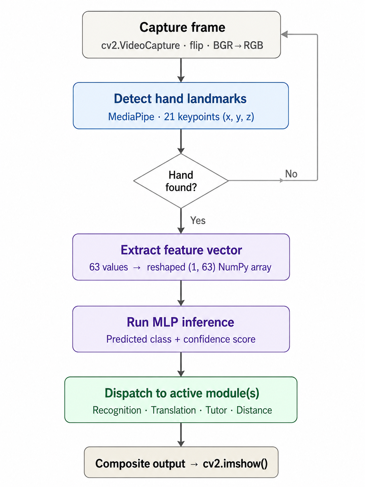
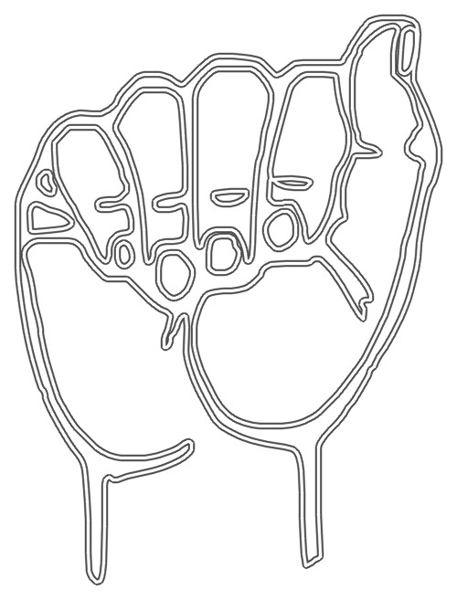
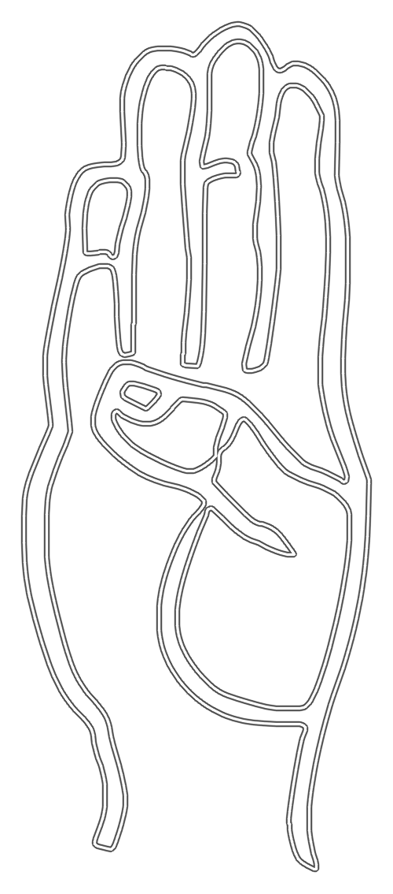
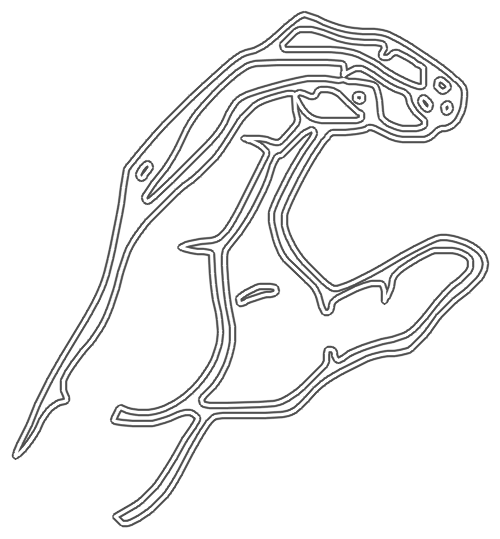
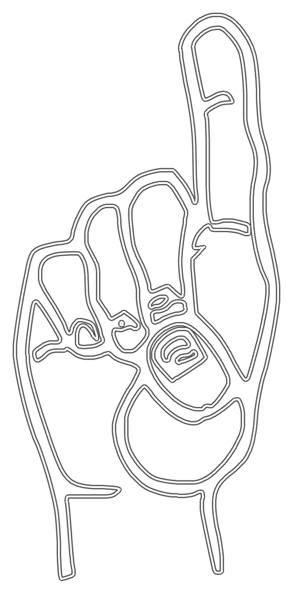

# HandSign AI Translator  
### Real-Time Hand Sign Classification with Arabic-Spanish Translation, ASL Tutor Mode, and Hand Distance Feedback


<p align="center">
  <b>AI385 Computer Vision Project — University of Prince Mugrin</b><br>
  Built with OpenCV, MediaPipe, TensorFlow/Keras, and Python
</p>

<p align="center">
  
  
  
  
</p>

---

## Overview

**HandSign AI Translator** is a real-time computer vision system that recognizes hand signs using a standard webcam.  
The system detects the hand, extracts landmark features, classifies the sign, translates the result into **Arabic** and **Spanish**, provides **ASL tutor feedback**, and gives **hand distance guidance** to improve recognition accuracy.

Unlike image-based models, this project is **landmark-based**.  
The model does not train on full images, backgrounds, clothes, lighting, or skin color. Instead, it learns from the hand structure extracted by MediaPipe.

---

## Demo Preview

## Demo Preview

### Word Recognition Classes
<p align="center">
  
</p>

### Real-Time Translation Output
<p align="center">
  
</p>

### ASL Tutor Mode
<p align="center">
  
</p>

### Hand Distance Feedback
<p align="center">
  
</p>

### System Architecture
<p align="center">
  
</p>

### End-to-End Workflow
<p align="center">
  
</p>

## Key Features

- Real-time hand sign recognition using webcam input
- Word sign classification for custom words:
  - **hi**
  - **good**
  - **thank you**
  - **how are you**
  - **computer vision**
- ASL letter recognition using a pre-trained MLP model
- Arabic and Spanish translation output
- Arabic text rendering support for OpenCV display
- ASL tutor mode with guide images
- Hand distance feedback to improve recognition reliability
- Landmark-based model for faster and more focused prediction

---

## How It Works

```text
OpenCV captures webcam frame
        ↓
MediaPipe detects the hand
        ↓
21 hand landmarks are extracted
        ↓
Each landmark has x, y, z coordinates
        ↓
21 × 3 = 63 numerical features
        ↓
Keras MLP model classifies the sign
        ↓
Prediction is displayed and translated
```

<p align="center">
  
</p>

---

## Word Recognition Module

The word recognition module was developed by **Juri Bandar Almarwani**.

This module classifies five complete hand signs directly from webcam input.  
Instead of spelling words letter by letter, each full hand sign is mapped to one word in a single prediction step.

### Landmark-Based Input

MediaPipe extracts **21 hand landmarks**.  
Each landmark contains:

```text
x, y, z
```

Therefore:

```text
21 landmarks × 3 coordinates = 63 features
```

Each dataset row is stored as:

```text
63 landmark values + label
```

Example:

```text
[0.21, 0.45, -0.02, ..., 0.11] → hi
```

---

## Deep Learning Model

The word recognition model is a **fully connected MLP** built with Keras.

### Model Details

| Component | Description |
|---|---|
| Input | 63 MediaPipe landmark features |
| Model Type | Fully Connected MLP |
| Hidden Layers | 512 → 256 → 128 → 64 → 32 |
| Activation | ReLU |
| Stabilization | Batch Normalization |
| Regularization | Dropout |
| Output Layer | 5 neurons |
| Final Activation | Softmax |
| Loss Function | Sparse Categorical Crossentropy |
| Optimizer | Adam |

### Why MLP?

The input is not an image.  
The input is a numerical feature vector of hand landmarks, so a fully connected MLP is suitable for learning the relationship between hand shape and sign class.

---

## Data Collection

The dataset was collected manually using a webcam.

For each hand sign, samples were saved in a CSV file as landmark values, not images.

```text
CSV format:
x0, x1, x2, ... x62, label
```

The model learns from:

```text
Hand geometry → Sign class
```

not from:

```text
Background, lighting, clothes, or image pixels
```

---

## Data Augmentation

Data augmentation was applied to the **landmark numbers**, not to images.

The augmentation included:

| Augmentation | Purpose |
|---|---|
| Noise | Simulates small MediaPipe detection changes |
| Scaling | Simulates the hand being closer or farther |
| Shifting | Simulates small hand movement in the frame |

This helps the model handle natural variations in hand position, size, and movement.

---

## Translation Feature

The system translates recognized text into:

- Arabic
- Spanish

Arabic text requires special rendering because OpenCV does not display Arabic correctly using `cv2.putText()`.

The Arabic rendering pipeline uses:

```text
arabic_reshaper → python-bidi → Matplotlib → OpenCV paste
```

---

## ASL Tutor Mode

The tutor mode helps users practice ASL letters.

The system shows a guide image for the target letter, then checks whether the user signs the correct letter.  
The user must hold the correct sign for several consecutive frames before moving to the next letter.

<p align="center">
  
  
  
  
</p>

---

## Hand Distance Feedback

The hand distance feature gives feedback when the hand is too close or too far from the camera.

This improves recognition reliability because the same sign can look different when the hand is at different distances.

---

## Project Structure

```text
HandSign-AI-Translator/
│
├── README.md
├── requirements.txt
├── LICENSE
├── .gitignore
│
├── ALLcombined_ASL_Arabic_Spanish_Distance_Word_TutorMode.ipynb
├── asl_mediapipe_mlp_model.h5
│
├── word model/
│   ├── gesture_word_model.h5
│   └── gesture_labels.npy
│
├── asl_tutor_guides/
│   ├── A.png
│   ├── B.png
│   ├── C.png
│   └── ...
│
└── assets/
    ├── banner.png
    ├── demo-main-interface.png
    ├── demo-translation.png
    ├── demo-tutor-mode.png
    └── pipeline-diagram.png
```

---

## Installation

Clone the repository:

```bash
git clone https://github.com/YOUR-USERNAME/HandSign-AI-Translator.git
cd HandSign-AI-Translator
```

Install the required libraries:

```bash
pip install -r requirements.txt
```

---

## Required Files

Make sure these files are available in the project folder:

```text
asl_mediapipe_mlp_model.h5
word model/gesture_word_model.h5
word model/gesture_labels.npy
asl_tutor_guides/
```

---

## How to Run

Open Jupyter Notebook:

```bash
jupyter notebook
```

Then open and run:

```text
ALLcombined_ASL_Arabic_Spanish_Distance_Word_TutorMode.ipynb
```

---

## Technologies Used

| Technology | Role |
|---|---|
| Python | Main programming language |
| OpenCV | Webcam access and real-time display |
| MediaPipe | Hand detection and landmark extraction |
| TensorFlow/Keras | Model loading, training, and inference |
| NumPy | Feature vector construction |
| Pandas | Dataset loading and processing |
| Scikit-learn | Label encoding and train/test splitting |
| Matplotlib | Arabic text rendering support |
| googletrans | Arabic and Spanish translation |
| arabic_reshaper | Arabic letter shaping |
| python-bidi | Right-to-left Arabic display |

---

## Team Members

| Team Member | Contribution |
|---|---|
| Juri Bandar Almarwani | Word Recognition Module |
| Roaa Abdulelah Alhejaili | Translation Module|
| Wajd Sultan Burhan | Sign Language Tutor Module |
| Joudi Khaleel Alharbi | Hand Distance Feature |

---

## Course Information

**Course:** AI385 — Computer Vision  
**University:** University of Prince Mugrin  
**College:** College of Computer Science and Engineering  
**Semester:** Spring 2026  

---

## Future Improvements

- Expand the vocabulary beyond five word signs
- Support continuous sentence-level signing
- Add two-hand sign recognition
- Improve model generalization with more users
- Deploy the system as a mobile or web application
- Add formal evaluation with accuracy, precision, recall, and F1-score

---

## License

This project is licensed under the MIT License.

---

## Final Note

This project demonstrates how computer vision and deep learning can be used to support accessibility.  
By combining webcam input, landmark extraction, sign classification, translation, tutor feedback, and distance guidance, the system provides a practical step toward real-time sign language understanding.
